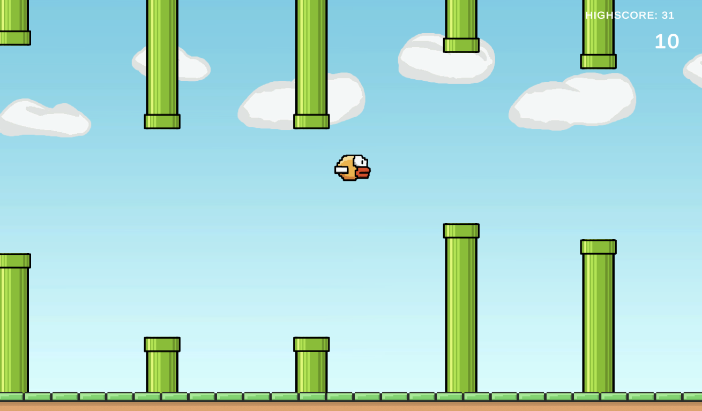

# Flappy Bird - Unity Project

This project is a 2D side-scrolling game similar to the classic Flappy Bird, developed using Unity. It was created as part of my Creative Core course to demonstrate my learning of game development in Unity.

## Project Overview

In this game, you control a bird that must navigate through pipes by avoiding collisions. The objective is to survive as long as possible by tapping the screen to make the bird flap and rise, while gravity pulls it downward. The game continues indefinitely, with increasing difficulty as the pipes speed up and their gap size narrows.

## Features

- **2D Side-scrolling Gameplay**: A classic Flappy Bird experience with smooth scrolling and pipe generation.
- **Player Controls**: Tap the screen to make the bird flap and rise.
- **Procedural Obstacles**: Randomly generated pipes with variable gaps for the player to navigate.
- **Scoring System**: A point is awarded each time the bird successfully passes through a pair of pipes. Your high score is tracked and displayed.
- **Game Over Screen**: Displays when the bird collides with a pipe or falls to the ground, along with the final score.

## Technologies Used

- **Unity**: The game engine used for development.
- **C#**: The primary programming language for game logic.
- **2D Sprites**: Custom assets used for the bird, pipes, and background.
- **Unity's Physics System**: Used to simulate gravity and collisions.
- **UI Elements**: Implemented to show the score, game-over screen, and buttons.

## Installation Instructions

1. Clone this repository or download the project files.
2. Open the project in Unity (ensure you're using a compatible version).
3. Press "Play" in Unity's editor to start the game.
4. (Optional) Build the game for your preferred platform (PC, mobile, etc.).

## Gameplay

- Tap to make the bird flap and rise.
- Avoid the pipes that scroll from right to left.
- The game ends when the bird collides with a pipe or hits the ground.
- Try to achieve the highest score possible!

## Challenges

During the development of this game, I faced challenges with collision detection and procedural generation of the pipes. Learning about how physics work in Unity and starting pipe generation super simple and expanding helped me figure out how to properly implement a realistic flappy bird experience.

## Future Plans

- Adding sound effects and background music.
- Implementing a more advanced scoring system, including achievements.
- Adding more variety to obstacles (e.g., moving pipes or rotating obstacles).
- A boss or special event every x score in a game. (Probably every 100 or so).

## Screenshots

<!-- ## Demo

(If available, include a link to a demo version of the game or video showcasing gameplay.) -->
